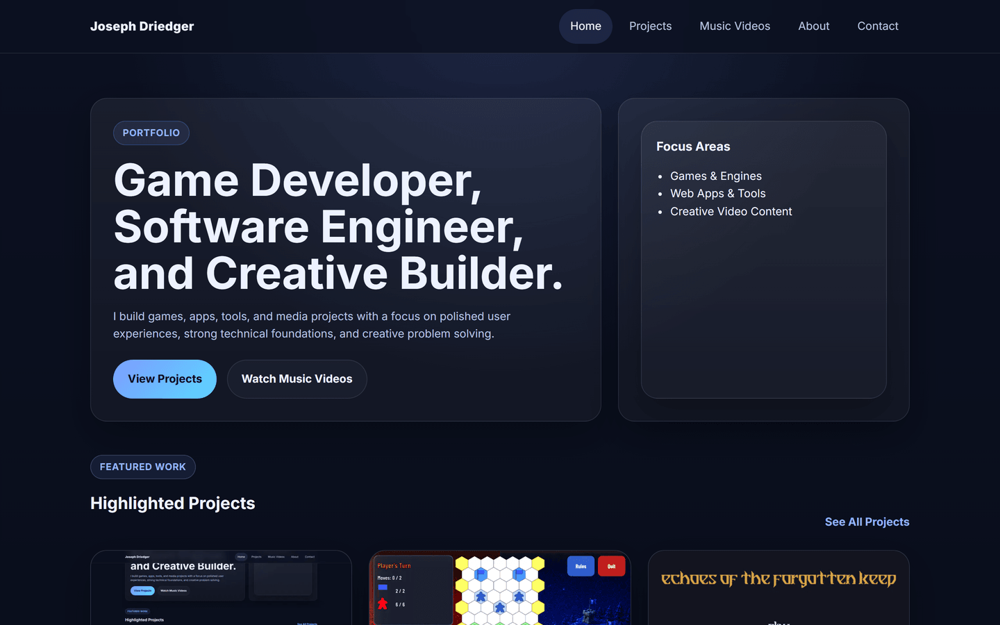
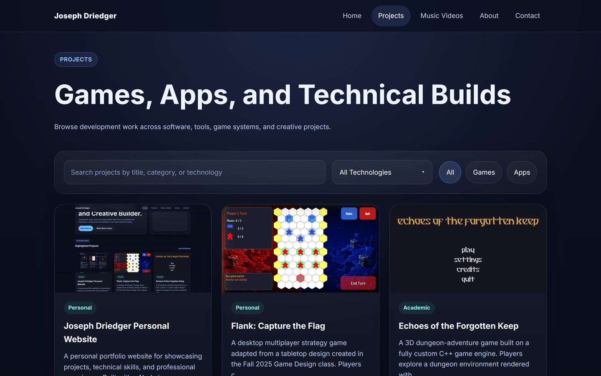
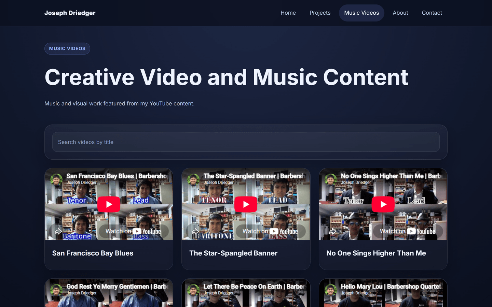
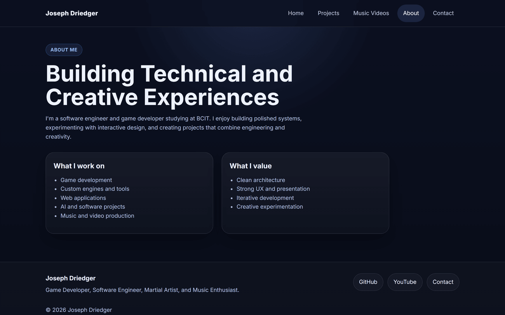
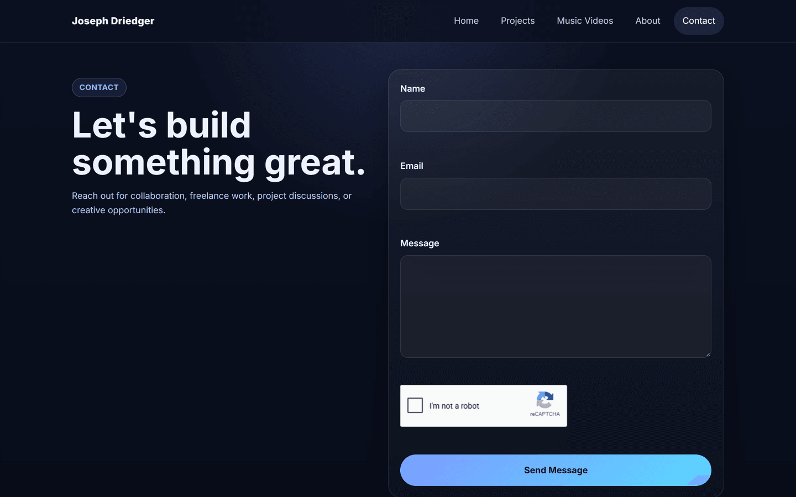
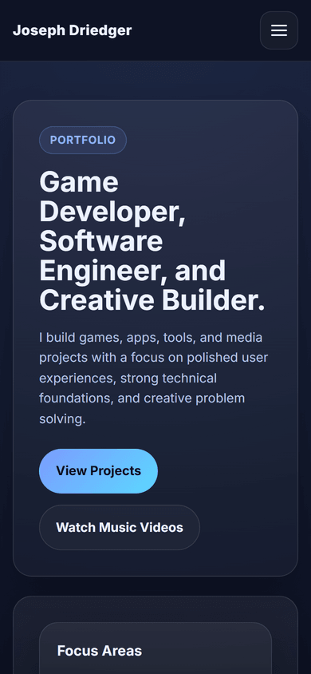

# Personal Website

A personal portfolio website built with Node.js and Express, featuring projects, videos, and a contact form.

Live site: [joeydriedger.ca](https://joeydriedger.ca/)

## Screenshots



| Projects | Music Videos |
|----------|--------------|
|  |  |

| About | Contact |
|-------|---------|
|  |  |



## Tech Stack

- **Runtime:** Node.js
- **Framework:** Express
- **View Engine:** EJS
- **Database:** MySQL (via `mysql2`)
- **Email:** Resend
- **Rate Limiting:** express-rate-limit

## Project Structure

```
src/
├── app.js                  # Express app setup
├── server.js               # Entry point
├── config/
│   └── db.js               # MySQL connection pool
├── controllers/            # Route handler logic
├── models/                 # Database queries
├── routes/                 # Route definitions
├── services/               # Business logic
├── middleware/             # Error handling, 404
└── utils/                  # Formatters, YouTube helpers
public/
└── js/                     # Client-side scripts
tests/                      # Unit and route tests
```

## Getting Started

### Prerequisites

- Node.js
- MySQL database

### Installation

```bash
npm install
```

### Environment Variables

Create a `.env` file in the project root:

```env
PORT=3000
DB_HOST=localhost
DB_PORT=3306
DB_USER=root
DB_PASSWORD=yourpassword
DB_NAME=PERSONAL_WEBSITE
ALLOW_DEV_DB=false

RESEND_API_KEY=your-resend-api-key
SMTP_FROM=contact@joeydriedger.ca
CONTACT_TO_EMAIL=you@example.com
```

### Running

```bash
# Development (database queries blocked by default)
npm run dev

# Development with database access
ALLOW_DEV_DB=true npm run dev

# Production
npm start
```

## Routes

| Route | Description |
|-------|-------------|
| `GET /` | Home page |
| `GET /projects` | Projects list with filters |
| `GET /videos` | Videos list with filters |
| `POST /contact` | Contact form submission |

## Notes

- In `development` mode, database queries are blocked unless `ALLOW_DEV_DB=true` is set. This prevents accidental production DB access during local development.
- Rate limiting is applied to protect the contact form endpoint.
